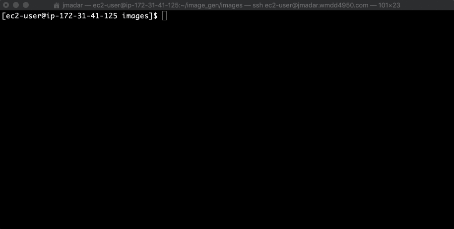
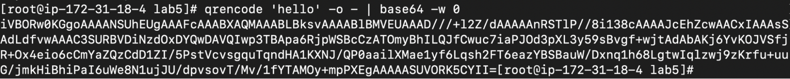

# Introduction

NOTE: Base64 encoding is technically not part of security, as encoding is
fully reversible and offers no protection whatsoever.  Nonetheless, base64
encoding is often used as part of a secured data exchange, as in the case of
JWT.

HTTP is primarily a text based protocol.  In fact, most of the web is dedicated to
transmission of text-based resources (HTML/CSS/Javascript files).  Text has the
advantage of being human readable and machine/OS agnostic (all OSes understand text
files).

What if we want to transfer binary data (such as images) within a text file?  Of
course we can  have 2 separate connections, one to transfer text, the other to
transfer images.  However, there are times when it’s desirable to combine both
resources in a single transfer.  This is where base64 encoding becomes extremely
valuable.

Simply put, base64 encoding allows encoding of an image file into text format,
as follows:



As bash is also a text-based terminal, doing a cat on an image file is meaningless.
However, if you use the base64 utility, it converts a binary file into text format
so it can be displayed by the terminal.  Most importantly, this piece of text can
now be transferred via text based systems (such as HTML, email, etc.)

In fact, I can transfer a base64 an image to your right now, simply copy and paste
the following line in your browser’s address bar:

```
data:image/png;base64,iVBORw0KGgoAAAANSUhEUgAAAFcAAABXAQMAAABLBksvAAAABlBMVEUAAAD///+l2Z/dAAAAAnRSTlP//8i138cAAAAJcEhZcwAACxIAAAsSAdLdfvwAAAC0SURBVDiNzdOxDcQgDAVQRym8BBJrpPNKsABhtHRZIxILkI4CxWdyp0tDnPKO6jUI+9sAXwf+whnAQQWwineujurMqhcT0Dh88CxXnuyLeTBXv141dC31+9V8e+laTsYrk64zbg5hKFbxARxpc6R5L3WQFlbNByRexkisugZMedLc6qcxolUsOQSpTXXLs6SDVMvsyhjPdxWHKbVIVfsCn327c5svv3O487m3JpBV/Ku/1vcLMG2tBhEoXH0AAAAASUVORK5CYII=
```

The above is known as dataURL
(https://developer.mozilla.org/en-US/docs/Web/HTTP/Basics_of_HTTP/Data_URIs).  

If you copy and paste the above data URL to a browser’s address bar, an image
will be displayed.  Notice, however, that there is no network activity as the image
data is inside the URL itself!  Data URL can also be used as src for images and
css background:  https://css-tricks.com/data-uris/

# QR Code App

Let’s create a simple QRCode generation api.  Start by installing the qrencode
program on your Linux server

```
sudo apt install qrencode
```

Explore the qrencode command line program. 

To create a qrencode for the string ‘Hello World’ and output it’s base64 version
to stdout, you would use the following command (the `-w 0` argument will disable
newline from the output of base64):

```
qrencode 'hello' -o - | base64 -w 0
```


Create a bash script inside the /usr/lib/cgi-bin/lab5/ directory called qrcode.sh
that takes as its argument a message and outputs an HTML document containing a QR
code with the message.  An example of the script can be accessed at 
https://learn.operatoroverload.com/~jmadar/security-base64-encoding/qrcode.sh?hello 

For marking purposes your html document should be accessible using link:
https://xxx.wmdd4950.com/cgi-bin/security-base64-encoding/qrcode.sh?hello

# Hand-in

Clone the assignment repo into your `${HOME}` directory, then execute pytest
in the `${HOME}/${ASSIGNMENT_REPO}/` to check if you got everything correct,
as follows:

```
cd ~
git clone ${ASSIGNMENT_REPO}
cd ${ASSIGNMENT_REPO}
pytest
```

When you are satisified, run the following commands to submit:

  - git add -A
  - git commit -a -m 'submit'
  - git push
